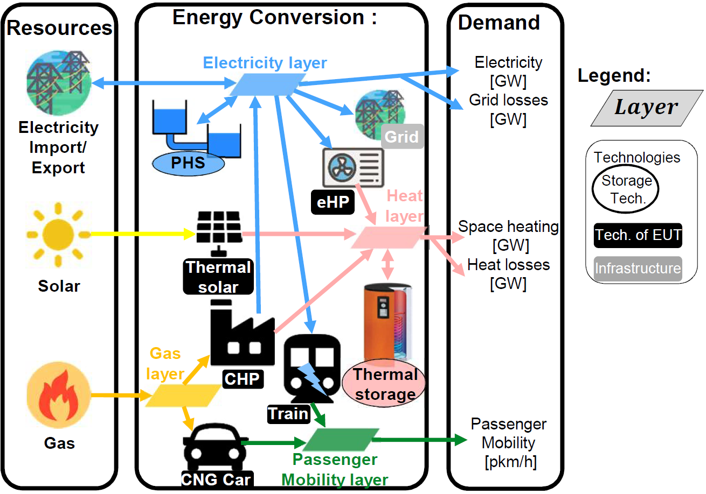
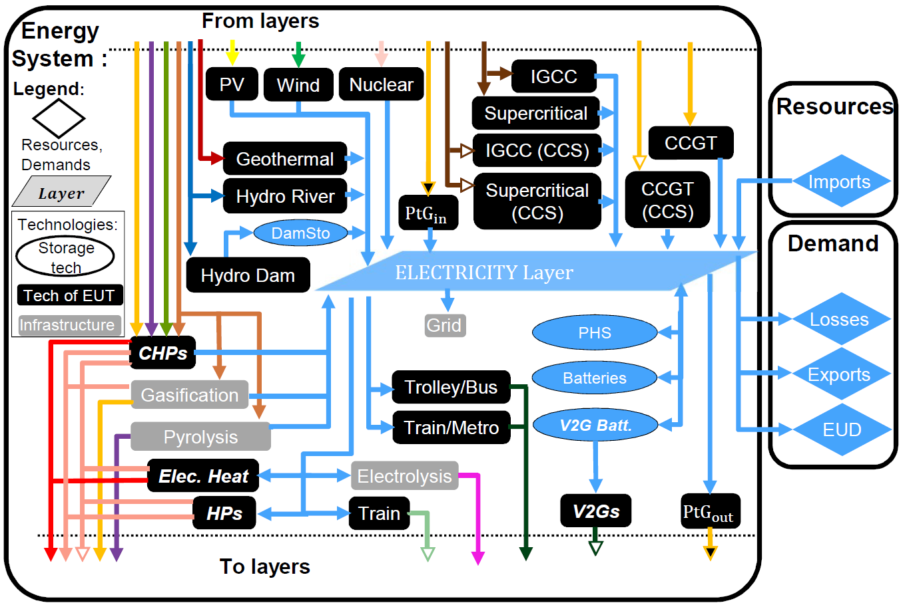

.. _LP:

Linear programming formulation
==============================

The model is mathematically formulated as a linear programming (LP) problem [1]_. We use the following nomenclature: *SETS* are in italic capital letters, *parameters* are in italic lower letters and **Variables** are bold in lower letter, with the first letter in capital (e.g. **Ctot**). *SETS* are collections of distinct items (as in the mathematical definition), e.g. the *RESOURCES* set regroups all the available resources (*NG*, *WOOD*, etc.). *Parameters* are known values (inputs) of the model, such as the demand or the resource availability. The value of the decision variables is determined (optimized) by the solver within an upper and a lower bound (the latter being parameters). As an example, the quantity of installed wind turbines is a decision variable; this quantity is bounded between 0 and the maximum available potential. *Decision variables* can be split in two categories: independent decision variables, which can be freely fixed, and dependent decision variables, which are linked via equality constraints to the previous ones. As an example the investment cost for wind turbines is a variable but it directly depends on the number of wind turbines, which is an independent decision variable. *Constraints* are inequality or equality restrictions that must be satisfied. Constraints can enforce, for example, an upper limit for the availability of resources, energy or mass balance, etc. Finally, an objective function is a particular constraint whose value is to be maximised (or minimised).

Conceptual modelling framework
------------------------------

The proposed modelling framework is a simplified representation of an energy system accounting for the energy ows within its boundaries. Its primary objective is to satisfy the energy balance
constraints, meaning that the demand is known and the supply has to meet the demand. In the energy modelling practice, the energy demand is often expressed in terms of final energy consumption (FEC). According to the definition of the European commission, FEC is defined as *"the energy which reaches the final consumer's door"* [2]_. In other words, the FEC is the amount of input energy needed to satisfy the end-use demand (EUD) in energy services. As an
example, in the case of decentralized heat production with a natural gas (NG) boiler, the FEC is the amount of NG consumed by the boiler; the EUD is the amount of heat produced by the boiler, i.e. the heating service needed by the final user.
The input for the proposed modelling framework is the EUD in energy services, represented as the sum of three components: electricity, heating and mobility; this replaces the classical sector-based representation of energy demand. Heat is divided in three end-use types (EUTs): high temperature heat for industry demand, low temperature for space heating and low temperature for hot water. Mobility is divided in two EUTs: passenger mobility and freight.
A simplified conceptual example of the proposed energy system structure is proposed in Figure 1.

Figure 1: Conceptual example of an energy system with 3 resources, 8 technologies (of which 2 storage and 1 infrastructure) and 4 end use demand (of which 1 losses). Abbreviations: pumped hydro storage (PHS), electrical heat pump (eHP), combined heat and power (CHP), compressed natural gas (CNG). Some icons are form [3]_.

The system is separated in three parts: resources, energy conversion and demand. In this illustrative example, resources are solar energy, electricity and NG. The EUD are electricity,space heating and passenger mobility. The energy system encompasses all the energy conversion technologies needed to transform resources and supply EUD. In this example, Solar and NG resources cannot be directly used to supply heat. Thus, they use technologies, such as boilers or combined heat and power (CHP) for NG, to supply the EUT layer (e.g. the high temperature industrial heat layer). *Layers* are defined as all the elements in the system that need to be balanced in each time period; they include resources and EUTs. An an example, the electricity layer must be balanced at any time, meaning that the production and storage must equal the consumption and losses. These layers are connected to each other by *technologies*. We define three types of technologies: *technologies of end-use type, storage technologies and infrastructure technologies*. A technology of end-use type can convert the energy (e.g. a fuel resource) from one layer to a EUT layer, such as a CHP unit that converts NG into heat and electricity. A storage technology converts energy from a layer to the same one, such as thermal storage (TS) that stores heat to provide heat. In this example, there are two storage technologies: TS for heat and pumped hydro storage (PHS) for electricity. An infrastructure technology regroups the remaining technologies including grids, such as the power grid and district heating networks (DHNs), but also technologies linking non end-use layers, such as methane production from wood gasification or hydrogen production from methane reforming.

As an illustrative example of the concept of *layer*, Figure 2 gives a perspective of the electricity layer which is the most complex one, since the electrification of other sectors is foreseen as a key of the energy transition [4]_. In the proposed version, 38 technologies are related to the electricity layer. 13 technologies produce exclusively electricity, such as natural gas combined cycle (CCGT), photovoltaic (PV) or wind. 10 combined heat and power (CHP) produce heat and electricity, such as industrial waste CHP. 1 infrastructure represents the grid. 5 storage technologies are implemented, such as PHS, hydro dams, batteries or vehicle-to-grid (V2G). The rest are consumers regrouped in the electrification of heat and mobility. Electrification of the heating sector is supported by direct electric heating but also by the more expensive but more efficient electrical heat pumps for low temperature heat demand. All the data for technologies and resources are reported in detail in Appendix 2. Electrification of mobility is achieved via electric public transportation (train, trolley, metro and electrical/hybrid buses), electric private transportation with the promising vehicle-to-grid (V2G) and hydrogen cars2 and trains for freight.

Figure 2: Representation of the Elec layer with all the technologies implemented in EnergyScope TDs. **_Bold Italic technologies_** represent a group of different technologies. Refer to Figure 6 of the main paper for color legend. Abbreviations: photovoltaic (PV), gas to power (GtP), integrated gasification natural gas combined cycle (IGCC), carbon capture and storage (CCS), natural gas combined cycle (CCGT), combined heat and power (CHP), heat pump (HP), pumped hydro storage (PHS), vehicle-to-grid (V2G), power to gas (PtG), end-use demand (EUD).

References
----------
.. [1] T. Hurlimann.\LPL: A mathematical programming language". In: OR Spektrum 15.1 (1993), pp. 43{55. issn: 01716468. doi: 10.1007/BF01783416. url: https://doi.org/10.1007/BF01783416
.. [2] European Commission - Eurostat. Glossary: Final Energy Consumption. (Visited on 12/14/2018).
.. [3] Freepik. url: www.flaticon.com