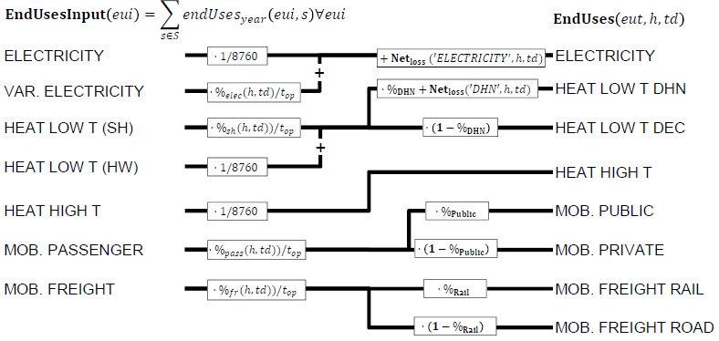
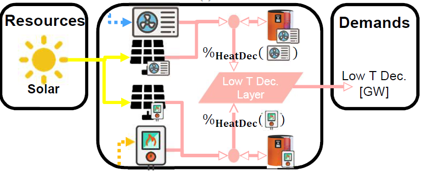
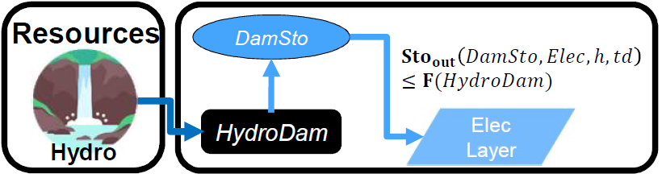
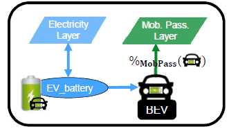

.. _LPFormulation:

Model formulation
=================

The energy system is formulated as a linear programming (LP) problem. It optimises the design by computing the installed capacity of each technology, as well as the operation in each period, to meet the energy demand and minimize the total annual cost of the system. In the following, we present the complete formulation of the model. It accounts for sets, parameters, variables, constraints and the objective function. The model formulation is expressed by the equations in Figure 4 and Eqs. (1)-(42).

End-use demand
^^^^^^^^^^^^^^

We use the end-use demand (EUD) instead of the final energy consumption (FEC) to characterise the demand. According to the definition of the European commission, FEC is defined as *"the energy which reaches the final consumer's door"* [3]_. In other words, the FEC is the amount of input fuel needed to satisfy the EUD in energy services. As an example, in the case of decentralized heat production with a gas boiler, the FEC is the amount of NG consumed by the boiler; the EUD is the amount of heat produced by the boiler, i.e. the heating service needed by the final user. This modelling choice has two advantages. First, it introduces a clear distinction between demand and supply. On the one hand, the demand concerns the definition of the end-uses, i.e. the requirements in energy services (e.g. the mobility needs). On the other hand, the supply concerns the choice of the energy conversion technologies to supply these services (e.g. the types of vehicles used to satisfy the mobility needs). Based on the technology choice, the same EUD can be satisfied with different FEC, depending on the efficiency of the chosen energy conversion technology. Second, it facilitates the inclusion in the model of electric technologies for heating and transportation.
The hourly end-use demand (**EndUses**) is computed based on the yearly end-use demand (*endUsesInput*), distributed according to a normalised time series.

Figure 4: **EndUses** calculation starting from yearly demand model inputs (*endUsesInput*). Adapted from [6]_. Abbreviations: space heating (sh), district heating network (DHN), hot water (HW), passenger (pass) and freight (fr).

Figure 4 graphically presents the constraints associated to the hourly end use demand (**EndUses**), e.g. the public mobility demand at time t is equal to the hourly passenger mobility demand times the public mobility share (%\ :sub:`Public`\ ).
Electricity end-uses result from the sum of the electricity-only demand, assumed constant throughout the year, and the variable demand of electricity, distributed across the periods according to  %\ :sub:`elec.`\ . Low-temperature heat demand results from the sum of the yearly demand for hot water (HW), evenly shared across the year, and space heating (SH), distributed across the periods according to %\ :sub:`sh`\ .
The percentage repartition between centralized (DHN) and decentralized heat demand is defined by the variable %\ :sub:`DHN`\ . High temperature process heat and mobility demand are evenly distributed across the periods. Passenger mobility demand is expressed in passenger-kilometers (pkms), freight transportation demand is in ton-kilometers (tkms). The variables %\ :sub:`Public`\  and %\ :sub:`Rail`\  define the penetration of public transportation in passenger mobility and of train in freight, respectively.

Cost, emissions and objective function
^^^^^^^^^^^^^^^^^^^^^^^^^^^^^^^^^^^^^^

The objective Eq. (1) is the minimisation of the total annual cost of the energy system (C\ :sub:`tot`\ ), defined as the sum of the annualized investment cost of technologies (τC\ :sub:`inv`\ ), the operating and maintenance cost of technologies (C\ :sub:`maint`\ ) and the operating cost of the resources (C\ :sub:`op`\ ). The total investment cost (C\ :sub:`inv`\  ) of each technology results from the multiplication of its specific investment cost ( c\ :sub:`inv`\ ) and its installed size (**F**), the latter defined with respect to the main end-uses output type Eq. (3).  C\ :sub:`inv`\  is annualised with the factor τ , calculated based on the interest rate (i\ :sub:`rate`\ ) and the technology lifetime (*lifetime*) Eq. (2). The total operation and maintenance cost is calculated in the same way Eq. (4). The total cost of the resources is calculated as the sum of the end-use over different periods multiplied by the period duration (t\ :sub:`op`\ ) and the specific cost of the resource (c\ :sub:`op`\ ) Eq. (5). Note that, in Eq. (5), summing over the typical days using the set T_H_TD is equivalent to summing over the 8760h of the year.

.. math::
	min  \mathbf{C_{tot}} = \sum_{j\in TECH}^{} (\tau (j)\mathbf{C_{inv}}(j) + \mathbf{C_{maint}}(j)) + \sum_{i \in RES}^{} \mathbf{C_{op}}(i)	(1)

.. math::
	s.t \; \; \;\tau (j) = \frac{i_{rate}*(i_{rate}+1)^{lifetime(j))}}{(i_{rate}+1)^{lifetime(j)-1)}}\; \; \; \forall j \in TECH	(2)

.. math::
	\mathbf{C_{inv}}(j) = c_{inv}(j)*\mathbf{F}(j)\; \; \; \forall j \in TECH (3)

.. math::
	\mathbf{C_{maint}}(j) = c_{maint}(j)*\mathbf{F}(j)\; \; \; \forall j \in TECH (4)

.. math::
	\mathbf{C_{op}}(i)=\sum_{t\in T\mid \left \{h,td  \right \}\in  THTD(t)}^{} c_{op}(i)*\mathbf{F_{t}}(i,h,td)t_{op}(h,td)\; \; \; \forall i \in RES (5)

The global annual greenhouse gas (GHG) emissions are calculated using a life cycle assessment (LCA) approach, i.e. taking into account emissions of technologies and resources \from cradle to grave". For climate change, the natural choice as indicator is the global warming potential (**GWP**), expressed in ktCO\ :sub:`2-eq`\ ./year. In Eq. (6), the total yearly emissions of the system (GWPtot) are defined as the sum of the emissions related to the construction and end-of-life of the energy conversion technologies (GWP\ :sub:`constr`\ ), allocated to one year based on the technology lifetime (*lifetime*), and the emissions related to resources (GWP\ :sub:`op`\ ). Similarly to the costs, the total emissions related to the construction of technologies are the product of the specific emissions (gwp\ :sub:`constr`\ ) and the installed size (**F**), Eq. (7). The total emissions of resources are the emissions associated to fuels (from cradle to combustion) and imports of electricity (gwp%\ :sub:`op`\ ) multiplied by the period duration (t\ :sub:`op`\ ) (Eq 8).

.. math::
	\mathbf{GWP_{tot}}= \sum_{j\in TECH}^{}\frac{\mathbf{GWP_{constr}}(j)} {lifetime(j))} +\sum_{i\in RES}^{} \mathbf{GWP_{op}}(i) (6)

.. math::
	\mathbf{GWP_{constr}}(j)=gwp_{constr}(j)\mathbf{F}(j)\; \; \; \forall j\in TECH (7)

.. math::
	\mathbf{GWP_{op}}(i)=\sum_{t\in \mid T\left \{ h,td \right \}\in THTD(t))}^{} gwp_{op}(i)\mathbf{F_{t}}(i,h,td)t_{op}(h,td)\; \; \; \forall i\in RES (8)

System design and operation
^^^^^^^^^^^^^^^^^^^^^^^^^^^

The installed capacity of technologies (**F**) is constrained between upper and lower bounds (f\ :sub:`max`\  and f\ :sub:`min`\), Eq. (9). This formulation allows accounting for old technologies still existing in the target year (lower bound), but also for the maximum deployment potential of a technology. As an example, for hydroelectric power plants, f\ :sub:`min`\ represents the existing installed capacity (which will still be available in the future), while f\ :sub:`max`\ represents the maximum potential.

.. math::
	f_{min}(j)\leq \mathbf{F}(j)\leq f_{max}(j)\; \; \; \forall j\in TECH (9)

The operation of resources and technologies in each period is determined by the decision variable F\ :sub:`t`\ . The capacity factor of technologies is conceptually divided into two components: a capacity factor for each period (c\ :sub:`p,t`\ ) depending on resource availability (e.g. renewables) and a yearly capacity factor (c\ :sub:`p`\ ) accounting for technology downtime and maintenance. For a given technology, the definition of only one of these two is needed, the other one being fixed to the default value of 1. Eqs. (10) and (11) link the installed size of a technology to its actual use in each period (F\ :sub:`t`\ ) via the two capacity factors. The total use of resources is limited by the yearly availability (*avail*), Eq. (12).

.. math::
	\mathbf{F_{t}}(j,h,td)\leq \mathbf{F}(j)c_{p,t}(j,h,td)\; \; \; \forall j\in TECH, \forall h\in H,\forall td\in TD (10)

.. math:: 
	\sum_{t\in T\mid \left \{h,td  \right \}\in  THTD(t)}^{}\mathbf{F_{t}}(j,h,td)t_{op}(h,td)\leq \mathbf{F}(j)c_{p}(j)\sum_{t\in T\mid \left \{h,td  \right \}\in  THTD(t)}^{}t_{op}(h,td)\; \; \; \forall j\in TECH (11)

.. math::
	\sum_{t\in T\mid \left \{h,td  \right \}\in  THTD(t)}^{}\mathbf{F_{t}}(i,h,td)t_{op}(h,td)\leq avail(i) \; \; \; \forall i\in RES (12)

The matrix *f* defines for all technologies and resources outputs to (positive) and inputs (negative) layers. Eq. (13) expresses the balance for each layer: all outputs from resources and technologies (including storage) are used to satisfy the EUD or as inputs to other resources and technologies.	

.. math::
	\sum_{i\in RES \cup TECH\setminus STO}^{}f(i,l)\mathbf{F_{t}}(i,h,td) +\sum_{j\in STO}^{} (\mathbf{STO_{out}}(j,l,h,td)-\mathbf{STO_{in}}(j,l,h,td))-\mathbf{EndUses}(l,h,td)=0\; \; \; \forall l\in L,\forall h\in H,\forall td\in TD (13)

Storage
^^^^^^^

The storage level (Sto\ :sub:`level`\ ) at a time step (*t*) is equal to the storage level at *t*-1 (accounting for the losses in *t*-1), plus the inputs to the storage, minus the output from the storage (accounting for input/output efficiencies (14) ). The storage systems which can only be used for short-term (daily) applications are included in the STO DAILY set. For these units, Eq. (15) imposes that the storage level be the same at the end of each typical day. Adding this constraint drastically reduces the computational time. For the other storage technologies, which can also be used for seasonal storage, the capacity is bounded by Eq (16). For these units, the storage behaviour is thus optimized over 8760h, as explained in the methodology Section of the paper.

.. math::
	\mathbf{Sto_{level}}(j,t)= \mathbf{Sto_{level}}(j,t-1)\cdot (1- %_{sto_{loss}}(j)) + t_{op}(h,td) \cdot (\sum_{l\in L\mid \eta _{sto,in(j,l)> 0)}}^{} \mathbf{Sto_{in}}(j,l,h,td)\eta _{sto,in}(j,l)- \sum_{l\in L \mid \eta _{sto,out(j,l)> 0)}}^{}\mathbf{Sto_{out}}(j,l,h,td)\eta _{sto,out}(j,l))
	\; \; \; \forall j\in STO, \forall t\in T\mid \left \{ h,td \right \} \in THTD(t) (14)

.. math::
	\mathbf{Sto_{level}}(j,t)=\mathbf{F_{t}}(j,h,td)\; \; \; \forall j\in STO DAILY, \forall t\in T\mid \left \{ h,td \right \}\in THTD(t) (15)

.. math::
	\mathbf{Sto_{level}}(j,t)=\mathbf{F}(j)\; \; \; \forall j\in STO \setminus STO DAILY, \forall t\in T (16)

Eqs. (17)-(18) force the power input and output to zero if the layer is incompatible. As an example, a PHS will only be linked to the electricity layer (input/output efficiencies > 0). All other efficiencies will be equal to 0, to impede that the PHS exchanges with incompatible layers (e.g. mobility, heat, etc). Eq. (19) limits the power input/output of a storage technology based on its installed capacity (**F**) and three specific characteristics. First, storage availability (%\ :sub:`sto,avail`\ ) is defined as the ratio between the available storage capacity and the total installed capacity (default value is 1). This parameter is required to realistically represent V2G, for which we assume that only a fraction of the fleet can charge/discharge at the same time. Second and third, the charging/discharging time (t\ :sub:`sto,in`\ , t\ :sub:`sto,out`\ ), which are the time to complete a full charge/discharge from empty/full storage5. As an example, a daily thermal storage can be fully discharged in minimum 4 hours (t\ :sub:`sto,out`\   = 4[h]), and fully charged in maximum 4 hours (t\ :sub:`sto,in`\  = 4[h]).

.. math::
	\mathbf{Sto_{in}}(j,l,h,td)\cdot (\left \lceil \eta _{sto,in}(j,l) \right \rceil -1)=0\; \; \; \forall j\in STO,\forall l\in L,\forall h\in H, \forall td\in TD (17)

.. math::
	\mathbf{Sto_{out}}(j,l,h,td)\cdot (\left \lceil \eta _{sto,out}(j,l) \right \rceil -1)=0\; \; \; \forall j\in STO,\forall l\in L,\forall h\in H, \forall td\in TD (18)

.. math::
	(\mathbf{Sto_{in}}(j,l,h,td)t_{sto_{in}}(j)-\mathbf{Sto_{out}}(j,l,h,td)t_{sto_{out}}(j))\leq \mathbf{F}(j).
	%_{sto_{avail}}(j) \; \; \; \forall j\in STO,\forall l\in L,\forall h\in H, \forall td\in TD (19)

Infrastructure
^^^^^^^^^^^^^^

Eq. (20) calculates network losses as a share (%\ :sub:`net,loss`\ ) of the total energy transferred through the network. As an example, losses in the electricity grid are estimated to be 7% of the energy transferred6. Eqs. (21)-(23) define the extra investment for networks. Integration of intermittent renewable energies (iRE) implies an additional investment costs for the electricity grid (c\ :sub:`grid,extra`\ ). As an example, the needed investments are expected to be 2.5 billions CHF\ :sub:`2015`\  for the high voltage grid and 9.4 billions CHF\ :sub:`2015`\  for the medium and low voltage grid7. Eq. (22) links the size of DHN to the total size of the installed centralized energy conversion technologies. The power-to-gas storage data is implemented as in Al-musleh et al. [9]. It is implemented in the model with two conversion units and a liquified natural gas (LNG) storage tank. *PowerToGas*\ :sub:`in`\  converts electricity to LNG, *PowerToGas*\ :sub:`out`\  converts LNG back to electricity. The investment cost is associated to the PowerToGas unit, whose size is the maximum size of the two conversion units, Eq. (23) here displayed in a compact non-linear formulation.

.. math::
	\mathbf{Net_{loss}}(eut,h,td)=(\sum_{i \in\,  RES\cup TECH\setminus STO\: \mid f(i,eut)> 0}^{}f(i,eut)\mathbf{F_{t}}(i,h,td)).%_{net_{loss}}(eut))\; \; \; \; \;  \forall eut=EUT,\forall h\in   H,\forall td\in TD (20)

.. math::
	\mathbf{F}(Grid)=\frac{c_{grid,extra}}{c_{inv}(Grid)}\cdot \frac{\mathbf{F}(Wind)+\mathbf{F}(PV)}{f_{max}(Wind)+f_{max}(PV)} (21)

.. math::
	\mathbf{F}(DHN)=\sum_{j\; \in\;  TECH\: OF\: EUT(HeatLowTDHN)}^{}\mathbf{F}(j) (22)

.. math::
	\mathbf{F}(PowerToGas)=max(\mathbf{F}(PowerToGas_{in}),\mathbf{F}(PowerToGas_{out})) (23)

Additional Constraints
^^^^^^^^^^^^^^^^^^^^^^
Nuclear power plants are assumed to have no power variation over the year (24). If needed, this equation can be replicated for all other technologies for which a constant operation over the year is desired.

.. math::
	\mathbf{F_{t}}(Nuclear,h,td)=\mathbf{P_{Nuc}}\; \; \; \forall h\in H, \forall td\in TD (24)

Eq. (25) imposes that the share of the different technologies for mobility (%\ :sub:`MobPass`\ ) be the same at each time step. In other words, if 20% of the mobility is supplied by train, this share remains constant in the morning or the afternoon. The addition of this constraint is motivated by the fact that the investment cost of passenger and freight transport technologies is not accounted for in the model (c\ :sub:`inv`\  = 0 for these technologies).

.. math::
	\mathbf{F_{t}}(j,h,td)=\mathbf{%_{MobPass}}(j)\sum_{l\in EUT\: of\: EUC(MobPass)}^{}\mathbf{EndUses}(l,h,td)\; \; \; \forall j \in TECH\: OF\: EUC(MobPass),\forall h \in H,\forall td \in TD (25)

Decentralised heat production:
^^^^^^^^^^^^^^^^^^^^^^^^^^^^^^

Thermal solar is implemented as a decentralized technology. It is always installed together with another decentralized technology, which serves as backup to compensate for the intermittency of solar thermal. Thus, we define the total installed capacity of solar thermal **F**(Dec\ :sub:`Solar`\ ) as the sum of F\ :sub:`sol`\ (j) (27), where F\ :sub:`sol`\ (j) is the solar thermal capacity associated to the backup technology j. Eq. (26) links the installed size of each solar thermal capacity (F\ :sub:`sol`\ (j)) to its actual production (F\ :sub:`t,sol`\ (j; h; td)) via the solar capacity factor (c\ :sub:`p,t`\ (Dec\ :sub:`Solar`\ ,h,td )).

.. math::
	\mathbf{F_{t_{sol}}}(j,h,td)\leq \mathbf{F_{sol}}(j)c_{p,t}(Dec_{Solar},h,td) \; \; \; \forall j \in TECH \: OF \: EUT(HeatLowTDec)\setminus \left \{ Dec_{Solar} \right \},\forall h \in H,\forall td \in TD  (26)

.. math::
	\mathbf{F}(Dec_{Solar})=\sum_{j \in TECH \: OF \: EUT(HeatLowTDec)\setminus \left \{ Dec_{Solar} \right \}}^{} \mathbf{F_{sol}}(j) (27)

A thermal storage i is defined for each decentralised heating technology j, to which it is related via the set *TS OF DEC TECH*, i.e. *i=TS OF DEC TECH(j)*. Each thermal storage *i* can store heat from its technology *j* and the associated thermal solar Fsol(j ). Similarly to the passenger mobility, Eq. (28) makes the model more realistic by defining the operating strategy for decentralized heating. In fact, in the model we represent decentralized heat in an aggregated form; however, in a real case, residential heat cannot be aggregated obviously. A house heated by a decentralised gas boiler and solar thermal panels should not be able to be heated by the electrical heat pump and thermal storage of the neighbours, and vice-versa. Hence, Eq. (28) imposes that the use of each technology (F\ :sub:`t`\ (j; h; td)), plus its associated thermal solar (F\ :sub:`t,sol`\ (j; h; td)) plus its associated storage outputs (Sto\ :sub:`out`\ (i; l; h; td)) minus its associated storage inputs (Sto\ :sub:`in`\ (i; l; h; td)) should be a constant share (%\ :sub:`HeatDec`\ (j )) of the decentralised heat demand (**EndUses**(HeatLowT; h; td)). Figure 5 shows, through an example with two technologies (a gas boiler and a heat pump (HP)), how decentralised thermal storage and thermal solar are implemented.

.. math::
	\mathbf{F_{t}}(j,h,td)+\mathbf{F_{t_{sol}}}(j,h,td)+\sum_{l\in L}^{}(\mathbf{Sto_{out}}(i,l,h,td)-\mathbf{Sto_{in}}(i,l,h,td))=\mathbf{%_{HeatDec}}(j)\mathbf{EndUses}(HeatLowT,h,td)\; \; \; \; \; \forall j \in TECH \: OF \: EUT(HeatLowTDec)\setminus \left \{ Dec_{Solar} \right \},\forall i \in TS \: OF \: DEC\: TECH (j),\forall h \in H,\forall td \in TD (28)

Figure 5: Illustrative example of a decentralised heating layer with thermal storage, solar thermal and two conventional production technologies, gas boilers and electrical HP. In this case, Eq. 28 applied to the electrical HPs becomes the equality between the two following terms: left term is the heat produced by: the eHPs (F\ :sub:`t`\ ('eHPs')), the solar panel associated to the eHPs (F\ :sub:`t,sol`\ ('eHPs')) and the storage associated to the eHPs; right term is the product between the share of decentralised heat supplied by eHPs (%\ :sub:`HeatDec`\ (`eHPs')) and heat low temperature decentralised demand (**EndUses**(HeatLowT; h; td)).

Hydroelectric dams:
^^^^^^^^^^^^^^^^^^^

Hydroelectric dams are implemented here as the combination of two components: a storage unit (the reservoir, or dam storage (*DamSto*)) and a power production unit (*HydroDam*). It has to be noted that, in this implementation, we differentiate between PHS and the storage unit with river inflow *DamSto*. PHS has a lower and upper reservoir without inlet source; *DamSto* has an inlet source, i.e. a river inflow, but cannot pump water from the lower reservoir. The power production technology *HydroDam* accounts for all the dam hydroelectric infrastructure cost and emissions. Eqs. (29)-(31) regulate the reservoir (*DamSto*) based on the production (*HydroDam*). Eq. 29 linearly relates the reservoir size with the power plant size (**F** (HydroDam)). Eq. 30 imposes the storage input power (Sto\ :sub:`in`\ ) to be equal to the water inflow term (**F** \ :sub:`t`\ (HydroDam; h; td)). This latter is constrained by Eq. 10 and represents the water in ow in the dam (Sto\ :sub:`in`\ ). Eq. (31) ensures that the storage output (Sto\ :sub:`out`\ ) be lower than the installed capacity (**F** (HydroDam)). Figure 6 shows how the reservoir (*DamSto*) and the power unit (*HydroDam*) are implemented.

.. math:: 
	\mathbf{F}(DamSto)\leq f_{min}(DamSto)+(f_{max}(DamSto)-f_{min}(DamSto))\cdot \frac{\mathbf{F}(HydroDam)-f_{min}(HydroDam)}{f_{max}(HydroDam)-f_{min}(HydroDam)} (29)

.. math::
	\mathbf{Sto_{in}}(DamSto,Elec,h,td)=\mathbf{F_{t}}(HydroDam,h,td)\; \; \; \forall h\in H,\forall td\in TD (30)

.. math::
	 \mathbf{Sto_{out}}(DamSto,Elec,h,td)=\mathbf{F}(HydroDam)\; \; \; \forall h\in H,\forall td\in TD(31)

Figure 6: Visual representation of hydro dams implementation in the model. The storage (*DamSto*) is filled by river inflows and can produce electricity through the *HydroDam* technology.

Vehicle-to-grid:
^^^^^^^^^^^^^^^^

Vehicle-to-grid dynamics are included in the model via the V2G set. For each vehicle *j* ϵ V2G, a battery *i* (i ϵ EVs BATT) is associated using the set EVs BATT OF V2G (i ϵ EVs BATT OF V2G(j)). Each type *j* of V2G has a different size of battery per car (ev\ :sub:`Batt,size`\ (j)), e.g. the first generation battery of the Nissan Leaf (ZE\ :sub:`0`\ ) has a capacity of 24 kWh. To estimate the number of vehicles of a given technology, we use the share of mobility covered supplied by this technology (%\ :sub:`MobPass`\ ) and the number of cars required if all the mobility was covered with private cars ncar,max. Thus, the energy that can be stored in batteries **F**(i) of V2G(j) is the product of the maximum number of cars (ncar,max) mutliplied by the share of the mobility
covered by the type of vehicle j (%\ :sub:`MobPass`\ (j)) and the size of battery per car (ev\ :sub:`Batt,size`\ (j)) (32). As an example, if all the drivers of Switzerland (5.8 millions [10]) owned a car and 5% of the mobility was supplied by Nissan Leaf (ZE\ :sub:`0`\ ), then the energy that could be stored by this technology would be 6.76 GWh.
Eq. (33) forces batteries of electric vehicle to supply, at least, the energy required by each associated electric vehicle technology. This lower bound is not an equality; in fact, according to the V2G concept, batteries can also be used to support the grid. Figure 7 shows through an example with only battery electric vehicles (BEVs) how Eq. (33) simplifies the implementation of V2G. In this illustration, a battery technology is associated to a BEV. The battery can either supply the BEV needs or restore electricity to the grid.

.. math::
	\mathbf{F}(i)=\eta _{car,max}\mathbf{%_{MobPass}}(j)ev_{Batt,size}(j)\; \; \; \forall j\in V2G, \forall i\in  EVs\: BATT \: OF \: V2G(j) (32)

.. math::
	\mathbf{Sto_{out}}(i,Elec,h,td)\geq -f(j,Elec)\mathbf{F_{t}}(j,h,td)\; \; \; \forall j\in V2G,\forall i\in  EVs\: BATT \: OF \: V2G(j), \forall h\in H, \forall td\in TD(33)

Figure 7: Illustrativee example of a V2G implementation. The battery can interact with the electricity layer. The V2G takes the electricity from the battery to provide a constant share (%\ :sub:`MobPass`\ ) of the passenger mobility layer (*Mob. Pass*.).

Peak demand:
^^^^^^^^^^^^

Finally, Eqs. (34)-(35) constrain the installed capacity of low temperature heat supply. Based on the selected typical days (TDs), the ratio between the yearly peak demand and the TDs peak demand is defined for space heating (%\ :sub:`Peak,sh`\  ). Eq. (34) imposes that the installed capacity for decentralised technologies covers the real peak over the year. Similarly, Eq. (35) forces the centralised heating system to have a supply capacity (production plus storage) higher than the peak demand.

.. math::
	\mathbf{F}(j)\geq  %_{Peak_{sh}} \underset{h\in H,td\in TD}{max}\left \{\mathbf{F_{t}}(j,h,td)  \right \} \; \; \; \forall j \in TECH \: OF \: EUT(HeatLowTDec)\setminus \left \{ Dec_{Solar} \right \} (34)

.. math::
	\sum_{j \in TECH \: OF \: EUT(HeatLowTDHN,i \in STO \: OF \: EUT(HeatLowTDHN)}^{}(\mathbf{F}(j)+\mathbf{F}(i) /t_{sto_{out}}(i,HeatLowTDHN)) \geq  %_{Peak_{sh}}\underset{h\in H,td\in TD}{max}\left \{ \mathbf{EndUses}(HeatLowTDHN,h,td) \right \} (35)

Adaptation for the case study
-----------------------------
Additional constraints are required to implement the scenarios and the Swiss hydroelectric power plants. Scenarios require four additional constraints (36-39) to impose a limit on the GWP emissions, the minimum share of renewable energies (RE) primary energy, the relative shares of some technologies, such as gasoline cars in the private mobility and the cost of energy efficiency measures. Due to the high penetration of hydropower in Switzerland and the good availability of data, the hydro potential has been split into old and new hydro plants and that changes three constraints (40-42). Eq. 36 imposes a limit on the GWP (*gwp*\ :sub:`limit`\ ). Eq. 37 fixes the minimum renewable primary energy share. Eq. 38 is complementary to Eq. 9, as it expresses the minimum (*f*\ :sub:`min,%`\ ) and maximum (*f*\ :sub:`max,%`\ ) yearly output shares of each technology for each type of EUD. In fact, for a given technology, assigning a relative share (e.g. boilers providing at least a given percent of the total heat demand) is more intuitive and close to the energy planning practice than limiting its installed size. *f*\ :sub:`min,%`\  and *f*\ :sub:`max,%`\  are fixed to 0 and 1, respectively, unless otherwise indicated. Eq. 39 imposes the cost of energy efficiency. The EUD is based on a scenario detailed in Section 2.1 and has a lower energy demand than the "business as usual" scenario, which has the highest energy demand. Hence, the energy efficiency cost represents the difference between the implemented scenario and the \business as usual" scenario. As explained later in 2.7.4, the implemented scenario has the lowest EUD, in counterpart, this scenario requires to invest the maximum in efficiency measures.

.. math::
	\mathbf{GWP_{tot}}\leq gwp_{limit}(36) 

.. math::
	\sum_{j\in RES_{re},t\in T\mid \left \{ h,td \right \}\in THTD(t)}^{}\mathbf{F_{t}}(j,h,td)\cdot t_{op}(h,td)\geq re_{share}\sum_{j\in RES,t\in T\mid \left \{ h,td \right \}\in THTD(t)}^{}\mathbf{F_{t}}(j,h,td)\cdot t_{op}(h,td)(37)

.. math::
	f_{min,%}(j)\sum_{{j}'\in TECH\: OF\:  EUT(eut),t\in T\mid \left \{ h,td \right \}\in THTD(t)}^{}\mathbf{F_{t}}({j}',h,td)\cdot t_{op}(h,td)\leq \sum_{t\in T\mid \left \{ h,td \right \}\in THTD(t)}^{}\mathbf{F_{t}}(j,h,td)\cdot t_{op}(h,td)\leq f_{max,%}(j)\sum_{{j}''\in TECH\: OF\:  EUT(eut),t\in T\mid \left \{ h,td \right \}\in THTD(t)}^{}\mathbf{F_{t}}({j}'',h,td)\cdot t_{op}(h,td)\; \; \; \; \; \;\forall eut\in EUT,\forall j\in TECH\: OF\:  EUT(eut) (38)

.. math::
	\mathbf{F}(Efficiency)=\frac{1}{1+i_{rate}} (39)

Due to the high penetration of hydropower in Switzerland and the good availability of data, the hydro potential has been split into old and new hydro plants. The old power plants have a fixed capacity and a known cost. Compared to the existing plants, the new power plants have a different price [6]. As a consequence, Eqs. (29-31) are modified to integrate the potential of new hydro dams and became, respectively, Eqs (40-42).

.. math::
	\mathbf{F}(DamSto)\leq f_{min}(DamSto)+(f_{max}(DamSto)-f_{min}(DamSto))\frac{\mathbf{F}(NewHydroDam)-f_{min}(NewHydroDam)}{f_{max}(NewHydroDam)-f_{min}(NewHydroDam)}(40)

.. math::
	\mathbf{Sto_{in}}(DamSto,Elec,h,td)=\mathbf{F_{t}}(HydroDam,h,td)+\mathbf{F_{t}}(NewHydroDam,h,td)\; \; \; \; \forall h\in H,\forall td\in TD (41)

.. math::
	\mathbf{Sto_{out}}(DamSto,Elec,h,td)\leq \mathbf{F}(HydroDam)+\mathbf{F}(NewHydroDam)\; \; \; \; \forall h\in H,\forall td\in TD(42)

Linearisation of integer variables
----------------------------------

Equations (25 and 28) multiply two variables among which **EndUses**. The latter is a dependent variable depending only on parameters, and thus it can be rewritten as a sum and products of parameters as shown in Figure 4.
Compared to the previous version of EnergyScope reported by Moret [6], the integer variables have been removed. In [6], they had the following use: (i) forcing the number of technologies to be an integer multiple of a reference size (e.g. one could only install 0.5, 1, 1.5, etc GW of CCGT if reference size is 0:5 GW); (ii) forcing that storage cannot charge and discharge at the same time; (iii) defining backup decentralised production technologies for thermal solar.
These variables were removed to reduce the computational time. As a consequence, (i) we accepted to have continuous size for installed capacities, such as 732 MW of CCGT; (ii) we systematically verify during the post treatment that a storage technology is not charging and discharging at the same time, which removes the need of using a binary variables. This change was also required to implement V2G, which can both charge and discharge. Complementarily, Eq. 19 verifies that the power charging and discharging are not higher than the maximum capacity. For example, assuming a case with 100 electric cars with a battery of 10kWh each, with an energy to power ratio of 10 (charging) and 5 (discharging) and with 20% of the cars are available to drive or charge. In this case, the charge and discharge powers are limited to a maximum of 20 or 40 kW, respectively, or a mix of the two. Finally, (iii) as illustrated in Section 1.3, the thermal solar implementation has been improved; the new formulation is more realistic and does not require the use of binary/integer variables.