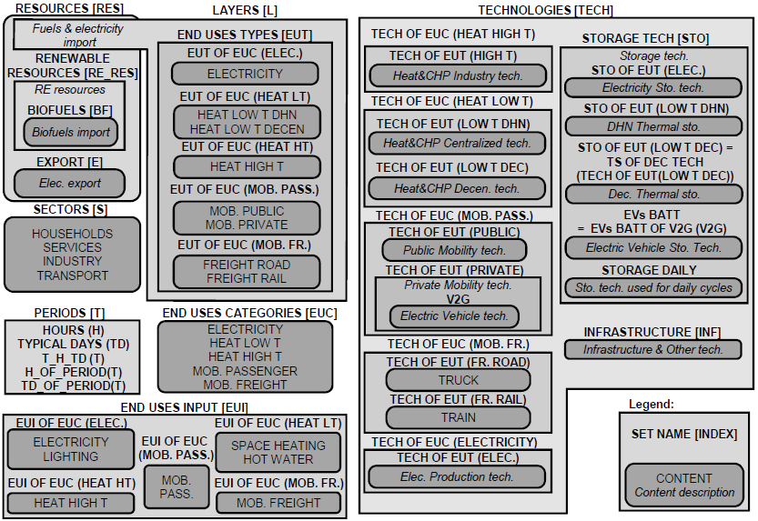

.. _Sets: 

Sets, parameters and variables
==============================

Figure 3 gives a visual representation of the sets with their relative indices used throughout the
paper.
In order to solve a yearly problem over 8760h, we define the sets H_OF_T(t), TD_OF_T(t) and T_H_TD(t) that give respectively, the hour (h), the typical day (td) or both (h,td) based on the period (t). E.g. if January 2 is associated to typical day 1, then H_OF_T(34) = 10, TD_OF_T(t) = 1 and T_H_TD(34) ={h = 10; td = 1}.
Tables 1 and 2 list and describe the model parameters. Tables 3 and 4 list and describe the independent and dependent variables, respectively.

Figure 3: Visual representation of the sets and indices of the LP framework. Abbreviations: space heating (SH), hot water (HW), temperature (T), mobility (MOB), vehicle-to-grid (V2G), thermal storage (TS).

Table 1: Time series parameter list with description. Set indices as in Figure 3

.. table::Time series parameter list with description 
    =============== =========== ===============================
	**Parameter**	**Units**	**Description**
	=============== =========== ===============================
	%elec(h,td)		[-]		Yearly time series (adding up to 1) of electricity end-uses
	%sh(h,td)	[-]	Yearly time series (adding up to 1) of SH end-uses
	%pass(h,td)	[-]	Yearly time series (adding up to 1) of passenger mobility end-uses
	%fr(h,td)	[-]	Yearly time series (adding up to 1) of freight mobility end-uses
	cp,t(tech,h,td)	[-]	Period capacity factor (default 1)
	=============== =========== ===============================

Table 2: Scenario parameter list with description. Set indices as in Figure 3

.. table::Scenario parameter list with description 
    =============== =========== ===============================
	**Parameter**			**Units**	**Description**
	=============== =========== ===============================
	
	
	=============== =========== ===============================

 