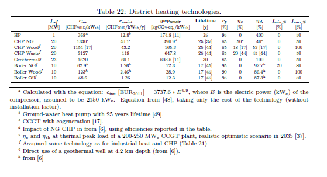
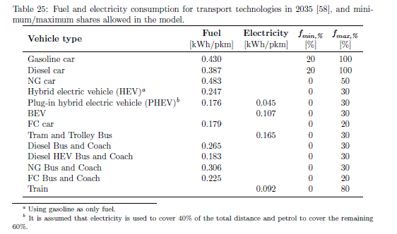
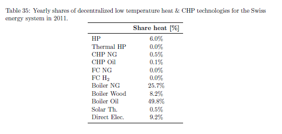

.. _Swiss:

Swiss energy system data
========================

This appendix reports the input data for the application of the LP modeling framework to the case study of Switzerland in the years 2035 and 2011, the latter used for model verification. The resources and technologies in Figure 6 of the paper are characterized in terms of energy and mass balances, cost (operating and investment), and environmental impact (global warming potential (GWP)).
For GHG emissions, LCA data are taken from the Ecoinvent database v3.2 [11] using the "allocation at the point of substitution" method. GWP is assessed with the "GWP100a - IPCC2013" indicator. For technologies, the GWP impact accounts for the technology construction; for resources, it accounts for extraction, transportation and combustion.
For the cost, the reported data are the nominal values for Switzerland in the year 2035. All costs are expressed in *real*  Swiss Francs for the year 2015 (\ :sub:`2015`\ ). All cost data used in the model originally expressed in other currencies or referring to another year are converted to CHF\ :sub:`2015`\  to offer a coherent comparison. The method used for the conversion is illustrated by Eq. 43.

.. math::
	c_{inv}\left [ CHF_{2015} \right ]=c_{inv}\left [ C_{y} \right ]\cdot \frac{USD_{y}}{C_{y}} \cdot \frac{CEPCI_{2015}\left [ USD_{2015} \right ]}{CEPCI_{y}\left [ USD_{y} \right ]}\cdot \frac{CHF_{2015}}{USD_{2015}}  (43)

.. list-table:: Table 5: CEPCI values [12]
   :widths: 25 25
   :header-rows: 1

   * - Year
     - CEPCI
   * - 1982 
     - 285.8
   * - 1990 
     - 357.6
   * - 1991
     - 362.3
   * - 1992
     - 367.0
   * - 1993
     - 371.7
   * - 1994
     - 376.4
   * - 1995
     - 381.1
   * - 1996
     - 381.7
   * - 1997
     - 386.5
   * - 1998
     - 389.5
   * - 1999
     - 390.6
   * - 2000
     - 394.1
   * - 2001
     - 394.3
   * - 2002
     - 395.6
   * - 2003
     - 402.0
   * - 2004
     - 444.2
   * - 2005
     - 468.2
   * - 2006
     - 499.6
   * - 2007
     - 525.4
   * - 2008
     - 575.4
   * - 2009
     - 521.9
   * - 2010
     - 550.8
   * - 2011
     - 585.7
   * - 2012
     - 584.6
   * - 2013
     - 567.3
   * - 2014
     - 576.1
   * - 2015
     - 556.3

Where C and *y* are the currency and the year in which the original cost data are expressed, respectively, is the symbol of American Dollars and the Chemical Engineering's Plant Cost Index (CEPCI) [12] is an index taking into account the evolution of the equipment cost (values reported in Table 5). As an example, if the cost data are originally in EUR\ :sub:`2010`\ , they are first converted to USD\ :sub:`2010`\ , then brought to USD\ :sub:`2015`\  taking into account the evolution of the equipment cost (by using the CEPCI), and finally converted to CHF\ :sub:`2015`\ . The intermediate conversion to USD is motivated by the fact that the CEPCI is expressed in *nominal* USD. ALthough this conversion method is originally defined for technology-related costs, in this thesis as a simplification it used also for the cost of resources.

Energy demand
-------------

The EUD for heating, electricity and mobility in 2035 is calculated from the data in [13] for the"Politisches Massnahmenpaket" ("PMF", Political Measures of the Federal Council) scenario in the year 2035.

Heating
^^^^^^^
The EUD for SH in households is calculated as the product of the number of inhabitants in Switzerland, the per capita living space and the annual specific heating requirement (Table 6). The EUD for HW in households is the only heating requirement which is not calculated based on the "PMF" scenario. It is calculated assuming a *per capita* daily HW consumption of 50L/day/inhabitant and a temperature increase of 40 °C [14].

.. list-table:: Table 6: Data for the calculation of the end use energy demand in the households sector.
   :widths: 45 30
   :header-rows: 1

   * - 
     - "PMF" scenario in 2035 [13]
   * - Population [10\ :sup:`6`\  people]
     - 8.89
   * - Living space [m\ :sup:`2`\ /person]
     - 67
   * - Specific heating requirement [kWh/m\ :sup:`2`\ /y]
     - 49.5
   * - HW consumption [L/day/person]
     - 50 [14]
   * - Temperature increase for HW production [°C]
     - 40

Table 7 reports input data and calculated values for the heating EUD in the different sectors. The calculation of the end-use heating demand in the industry and services sectors starts from the FEC data by type of heat usage, available in Table 9-18 and Table 9-23 in [13]. The FEC values reported in [13] are the sum of the fuel consumption in boilers, the electricity consumption for direct electric heating and for HPs, and the ambient heat used by the latter. The EUD for heating in the industry and service sectors accounts for the heat supplied by the HPs (equal to the sum of the ambient heat and their electricity consumption), the heat produced by direct electric heating systems (equal to their electricity consumption) and the heat supplied by boilers (which is estimated assuming a 90% efficiency).
For both sectors, first the FEC is shared among the different technologies, then it is proportionally divided among space heating, hot water and process heating. The ambient heat consumption is obtained from tables 9-21 and 9-27 in [13]. The electricity consumed by the heat pumps using the reported ambient heat is calculated using a coefficient of performance (COP) of 3.7. The COP is based on the ambient heat and electricity consumption of the heat pumps in the household sector in 2035 (table 9-7 and 9-10 in [13]). The electricity consumption for direct electric heating is computed as the sum of the electricity consumption for space heating, hot water and process heating (Tables 9-19 and 9-24 in [13]) minus the calculated electricity consumption of the heat pumps. The use of direct electric heating systems is divided between space heating, hot water and process heating proportionally to the FEC of each end-use type. It is assumed that heat pumps are not used for the high temperature EUD in the industry sector. Thus, the use of heat pumps is shared between space heating and hot water.
In the model, there is a repartition between low temperature and high temperature heating EUD. The first one includes EUD for space heating and hot water. The second one is the EUD for process heating. The services sector has only low temperature heating EUD, while the industry sector has both.

Process heating and HW demand are considered constant over the year, whereas SH demand is shared over the year according to %\ :sub:`heating`\ , which is illustrated in Figure 8 (based on the data presented in Appendix D of [15]). Another illustration is Table 8 that summarises these data by aggregating the monthly heat demands.

Figure 8: Normalised space heating time series over the year.

.. list-table:: Table 8: Aggregated monthly distribution factors for SH demand (%\ :sub:`heating`\ ) and varying electricity demand (%\ :sub:`elec`\ ). Yearly share (adding up to 1) of space heating and electricity [-]
   :widths: 7 7 7 7 7 7 7 7 7 7 7 7 7  
   :header-rows: 1

   * - Month
     - Jan.
     - Feb.
     - Mar.
     - Apr.
     - May
     - Jun.
     - Jul.
     - Aug.
     - Sep.
     - Oct.
     - Nov.
     - Dec.
   * - %\ :sub:`heating`\ 
     - 0.179
     - 0.168
     - 0.138
     - 0.064
     - 0.036
     - 0.010
     - 0.007
     - 0.010
     - 0.029
     - 0.078
     - 0.111
     - 0.170
   * - %\ :sub:`elec`\ 
     - 0.091
     - 0.081
     - 0.089
     - 0.079
     - 0.081
     - 0.079
     - 0.078
     - 0.080
     - 0.082
     - 0.084
     - 0.086
     - 0.089
    

Electricity
^^^^^^^^^^^
The values in Table 9 list the electricity demand that is not related to heating for the three sectors in 2035. The values are taken from tables 9-11, 9-13, 9-15, 9-19 and 9-24 in [13]. The varying demand of electricity is shared over the year according to %\ :sub:`elec`\ , which is represented in Figure 9 (based on the data presented in Appendix D of [15]). Table 8 summarises these data by aggregating the monthly electricity demands.

Figure 9: Normalised electricity time series over the year.

Mobility
^^^^^^^^
The annual passenger transport demand in Switzerland for 2035 is expected to be 146e09 passenger-kilometers (pkms) [13]. Passenger transport demand is divided between public andprivate transport. The lower (%\ :sub:`public,min`\ ) and upper bounds (%public,max) for the use of publictransport are 30% and 50% of the annual passenger transport demand, respectively. Thepassenger mobility demand is shared over the day according to %pass. We assume a constant passenger mobility demand for every day of the year. This latter is represented in Figure 10 (data from Figure 12 of [16]).
The annual freight transport demand in Switzerland for 2035 is expected to be 40.0e09 tonkilometers (tkms). It is shared between road (trucks) and rail (train) freight transport [13].The lower (%\ :sub:`rail,min`\ ) and upper bounds %\ :sub:`rail,max`\ ) for the use of freight trains are 40% and 60% of the annual freight transport demand, respectively

Figure 10: Normalised passenger mobility time series over a day. We assume a similar passenger mobility demand over the days of the year

Electricity production and hydro dams
-------------------------------------

Renewables
^^^^^^^^^^

Data for the considered renewable electricity production technologies are listed in Table 10. In Table 10, the yearly capacity factor (c\ :sub:`p`\ ) is reported. As described in the methodology Section of the paper, for seasonal renewables the capacity factor c\ :sub:`p;t`\  is defined for each time period. These capacity factors are represented in Figure 11. For these technologies, c\ :sub:`p`\  is the average of c\ :sub:`p;t`\ . The hourly values are aggregated per month and reported in Table 11. For all the other electricity supply technologies (renewable and non-renewable), c\ :sub:`p;t`\  is equal to the default value of 1. 

**Hydro power in Switzerland** 
The projected capacity factors for hydroelectric run-of-river plants and dams are calculated based on the data in Table 12. A decrease in the electricity production is expected in the next years due to the application of the LEaux law [30]. The law defines the minimum flow rates for rivers. In order to respect them, during some periods of the year it may be necessary to stop the power plants, i.e. letting the water flow bypassing the turbines. This will have as a consequence a decrease in the annual electricity production. The decrease in electricity production is estimated to be 1400 GWh/y [30]. In the model, the LEaux production penalty is shared between run-of-river plans and dams proportionally to their net yearly electricity production. The net electricity production is the total electricity production minus the electricity consumed for the pumping in the dams.

The Swiss Federal Office of Energy (SFOE) has evaluated the development potential for hydroelectricty [30]. The results of the study are presented in Table 13.
Forecasts in [13] for the year 2050 are based on the development potential under optimized conditions in Table 13. This potential is distributed between hydro river and hydro dam (Table 14).

Figure 11: Capacity factor for the different renewable energy sources over the year. There is no hourly data source available giving the water in flows for hydro dam and hydro river (See Chapter 3 of [15]). However week data are available. To obtain hourly values, the weekly data are interpolated.

.. image:: images/swiss/table14.PNG

In the model, this additional potential is added to the 2012 net electricity production to obtain the electricity production potential of Swiss hydroelectric power plants in 2050 (Table 15). The small hydro potential is attributed to the hydro run-of-river technology as additional capacity. The values in Table 15 for 2050 already include the decrease in production caused by the LEaux law.
The energy storable in existing dams is 8835 GWh [31]. Currently in Switzerland there is an electricity deficit during winter and an electricity surplus during summer months. Hydroelectric dams help equilibrating the seasonal balance by storing a fraction of the water harvested during spring and summer, for additional electricity production in winter months. Nonetheless, this "shifting capacity" is limited, as dams are forced to turbine water during summer months (despite the excess of electricity production) to avoid the risk of dam over flow [32]. As a consequence, the energy stored in dams never reaches its maximum capacity. As an illustration, the maximum yearly energy stored has  fluctuated around 85% of its maximum capacity over the seven last years [31]. Hence, in the model, we assume an available size of reservoir of 7500 GWh (85% of 8835 GWh).

Increasing the heights of existing dam has two consequences: an additional net electricity production (Table 16) and an additional storage capacity of 2400 GWh [33]. In the model, the energy stored in dams is represented by the StoDam technology, described methodology Section of the paper.
Table 17 and Table 18 contain the data used for the calculation of the specific investment and O&M costs reported in Table 10. The capacity factors calculated in Table 12 are used for the calculation of the installed power.

Data for the considered fossil electricity production technologies are listed in Table 19. The maximum installed capacity (f\ :sub:`max`\) is set to a value high enough (10 GWe) for each technology to potentially cover the entire demand. For carbon capture and storage (CCS) technologies, a
90% capture rate is assumed.

The modeled seasonal storage option consists in the production of synthetic methane from the excess of electricity. This synthetic methane is then used for producing electricity during periods of deficit in electricity supply. This procedure is also known as Power-to-NG-to-Power. The seasonal storage model is based on the liquified CH\ :sub:`4`\-CO\ :sub:`2`\ system (LM-C) presented by Al-musleh et al. [39]. It consists of a reversible fuel cell (FC) which is used as electrolyzer to produce hydrogen when there is excess electricity in the grid. The hydrogen is sent to a methanation reactor where it is mixed with CO\ :sub:`2`\ to produce methane which is liquified (LNG) previous to storage. When there is a shortage of electricity, the methane is gasified and oxidized in the FC to produce electricity. The produced CO\ :sub:`2`\ is liquified and stored for being used as input of the methanation reaction; thus, this system is a carbon closed loop, as there is no emission of CO\ :sub:`2`\.
The elements considered for the calculation of the investment and O&M costs are the reversible FC, the liquefaction train and the tanks for storing CH4 and CO\ :sub:`2`\. The data required for the cost calculation is available in Table 20. It has been assumed that the O&M cost (c\ :sub:`maint`\) are 5% of the initial investment cost, and that the lifetime of the different components is 25 years.

Electricity grid
^^^^^^^^^^^^^^^^^^
The replacement cost of the Swiss electricity grid is 58.6 billions CHF\ :sub:`2015`\ [42] and its lifetime is 80 years [43]. The electricity grid will need additional investment depending on the penetration level of the decentralized and stochastic electricity production technologies. The needed investements are expected to be 2.5 billions CHF\ :sub:`2015`\ for the high voltage grid and 9.4 billions CHF\ :sub:`2015`\ for the medium and low voltage grid. These values correspond to the scenario 3 in [42]. The lifetime of these additional investments is also assumed to be 80 years.

Heating and cogeneration technologies
-------------------------------------

Table 21, Table 22 and Table 23 detail the data for the considered industrial, centralized and decentralized CHP technologies, respectively. In some cases, it is assumed that industrial (Table 21) and centralized (Table 22) technologies are the same.
f\ :sub:`min`\ and f\ :sub:`max`\ for heating and CHP technologies are 0 and 20 GW\ :sub:`th`\, respectively. The latter value is high enough for each technology to supply the entire heat demand in its layer. Thus, for heating and cogeneration technologies the maximum and minimum shares are controlled in the model by f\ :sub:`min,%`\ and f\ :sub:`max,%`\ , respectively.
For the DHN, the investment for the network is also accounted for. The specific investment (c\ :sub:`in`\) is 882 CHF\ :sub:`2015`\ /kW\ :sub:`th`\. This value is based on the mean value of all points in [50] (Figure 19), assuming a full load hours of 1535 per year (see table 25 in [50]). The lifetime of the DHN is expected to be 60 years. The lower (%\ :sub:`dhn,min`\) and upper bounds (%\ :sub:`dhn,max`\)  for the use of DHN are 10% and 30% of the annual low temperature heat demand, respectively.
Figure 12 represents the capacity factor (c\ :sub:`p,t`\ ) of solar thermal panels. In addition, Table 24
reports the monthly distribution factors (data from Appendix D of [15]). For all the other heat
supply technologies (renewable and non-renewable) c\ :sub:`p,t`\ is equal to the default value of 1.

Figure 12: Capacity factor of thermal solar panels over the year.

Transport
---------

In the model, for transport technologies only the operating cost (fuel consumption) is considered. Investment, O&M costs and emissions associated to the construction are not accounted for. The efficiencies for the passenger vehicles in 2035 (Table 25) are calculated with a linear interpolation between the 2010 and 2050 values presented in Table 6 in Codina Gironès et al [58]. For private mobility, the average occupancy assumed in [58] is 1.6 passenger/vehicle (data for the year 2010 in Switzerland, from [59]).

Resources
---------
The availability of all resources, except for wood and MSW, is set to a value high enough to allow unlimited use in the model. No import of hydrogen or biofuels is accounted for in the implementation. Wood availability is 12279 GWh/y [60] ("wet wood", 50% humidity, LHV\ :sub:`wb`\ = 8.279 MJ/kg\ :sub:`wb`\, from [6]), while MSW is limited to 11142 GWh. For the calculation of the MSW availability it is considered that the average *per capita* annual waste production is 730 kg (2014 data for Switzerland, from [61]), 50% of it is recycled [62] and the lower heating value (LHV) is 12.35 MJ/kg ( from [6]). The number of inhabitants in Switzerland in 2035 is expected to be 8.90 millions [13].
Table 26 details the prices of resources (c\ :sub:`op`\) and the GHG emissions (gwp\ :sub:`op`\) associated to their production, transportation and combustion. c\ :sub:`op`\ for imported biofuels is assumed to be equal to the price of the respective fossil equivalent. No cost is associated to the MSW, as it is assumed that it should be collected anyway. Export of electricity are possible, but they are associated to a zero selling price.

Storage
-------

Table 27 and 28 detail the data for the storage technologies (except hydro dams which has been presented in Section sec:hydro). Table 27 summarises the cost of investment, GWP, lifetime and potential integration of the different technologies. Table 28 summarises the technical performances of each technology.

Other parameters
----------------

Hydrogen production
^^^^^^^^^^^^^^^^^^^
Three technologies are considered for hydrogen production: electrolysis, NG reforming and biomass gasification. The last two options include CCS systems for limiting the CO\ :sub:`2`\  emissions. Table 29 contains the data for the hydrogen production technologies.

Biomass to synthetic fuels
^^^^^^^^^^^^^^^^^^^^^^^^^^
Two technology options are considered for the conversion of woody biomass to synthetic fuels: pyrolysis and gasification. The main product of the pyrolysis process is bio-oil, which is considered equivalent to fossil LFO. The main product of the gasification process is synthetic natural gas (SNG), which is considered equivalent to fossil NG. Data for the technologies are reported in Table 30 (from [6]). In the table, efficiencies are calculated with respect to the wood in input (50% humidity, on a wet basis LHV) and "fuel" stands for the main synthetic fuel in output.

Energy demand reduction cost
^^^^^^^^^^^^^^^^^^^^^^^^^^^^
The energy efficiency cost is a cost difference between the "business as usual" scenario, which has the highest energy demand, and the "Political measures of the Federal Council" scenario in [13]. The cost is divided in two categories: private households and industry and services. The values are 806 MCHF\ :sub:`2015`\ /y and 1050 MCHF\ :sub:`2015`\ /y respectively [79]. As in the model only the "PMF" scenario is considered for the energy demand (Table 7), the demand reduction is a fixed cost in the model.

Other
^^^^^
The real discount rate for the public investor irate is fixed to 3.215%, average of the range of values used to define the corresponding uncertainty range (see Section *Electricity grid* in [6]).

.. image:: images/swiss/table30.PNG

Losses (%\ :sub:`netlosses`\) in the electricity grid are fixed to 7%. This is the ratio between the losses in the grid and the total annual electricity production in Switzerland in 2015 [80]. DHN losses are assumed to be 5%.
The input and output efficiency of the storage (η\ :sub:`sto,in`\ and η\ :sub:`sto,out`\ ) are defined to allow the connection between the storage technologies (*StoHydro* and *Power2Gas*) and their respective layers (electricity and LNG, respectively). The effciency is 1 in all cases as the *StoHydro* unit represents a "shift" in the monthly production of the dams, while the LNG storage tank is assumed to have no losses.

2011 data for model verification
--------------------------------

This section details the data of the Swiss energy system in the year 2011 used to validate the mixed-integer linear programming (MILP) model in the validation Section of the paper. The input data for the year 2011 used for the model validation are: i ) the yearly EUD values in the different sectors (*endUses*\ :sub:`year`\); ii ) the relative annual production shares of the different technologies for each type of EUD; iii ) the share of public mobility (%\ :sub:`Public`\), of train in freight (%\ :sub:`Rail`\) and of centralized heat production (%\ :sub:`Dhn`\); iv ) the fuel efficiency of mobility technologies.
The FEC data for Switzerland in the year 2011 are available in [13, 59, 81]. The EUD is calculated based on the FEC using a similar procedure as the one described in Section 2.1.1. The obtained input data for model verification are reported in Table 31. %\ :sub:`Public`\, %\ :sub:`Rail`\ and %\ :sub:`Dhn`\ are reported in Table 32 with the corresponding sources.

The annual net electricity production shares for electricity production technologies is taken from [82]. The yearly shares of mobility and heating & CHP technologies per type of EUD (with respect to the main output) are reported in Tables 33-37.
For public mobility (Table 33, [81, 82]), it is assumed that all biofuels and NG are used in public mobility, and that the electricity not used in freight is shared between trains and trolleybus with a 60%-40% share, respectively. For private mobility (Table 34, [59, 81]) the repartition between the different types of vehicles is estimated based on the number of vehicles in Switzerland in 2012 (77% gasoline, 22% diesel, 1% hybrid) and their fuel efficiencies. For all mobility technologies, 2010 efficiencies from [58] are used in the model verification.
For low and high temperature heat production (Tables 35, 36 and 37, [13, 81{83]), the electricity production from CHP plants is taken from [83], Table A.2), while the input fuel and the heat production are estimated based on the efficiencies assumed for 2035. In the validation Section of the paper, for DHN it is assumed that all waste is used in CHP units, although in reality a share of waste is only used for electricity production.

