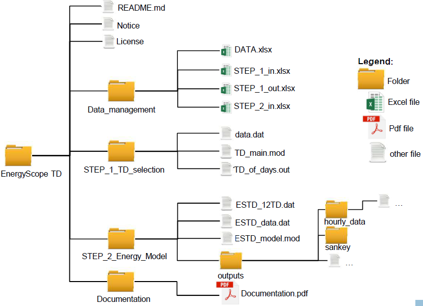

.. _workflow:

Getting Started
===============

The code, its documentation and the case study are gathered on a GitHub repository1. In the index and the README.md file is summarise how to launch the energy model in four steps. Here below, we propose an extensive explanation including how to compute the typical days and manage data. The data are managed through excel files which are related ones to each others. The models are coded in AMPL, using the solver CPLEX. However, the energy model proposed can be run using the open-source GLPK and the GLPSOL solver.

Files structure and download
----------------------------

EnergyScope Typical Days (EnergyScope TD) is structured as shown in Figure 13. A main folder contains three sub-folders, first one is dedicated to data management. Second, for the files related to typical days selection (STEP 1). Third and last branch regroups the files related to the energy model (STEP 2). Table 38 describes each files.
By ensuring that the download files respect the structure, the links between files should be respected and User could use the quick start procedure to launch the code.

.. list-table:: Table 35: Yearly shares of decentralized low temperature heat & CHP technologies for the Swiss energy system in 2011.
   :widths: 25 15
   :header-rows: 1

   * - Technologies
     - Share heat[%]
   * - HP
     - 6.0%
   * - Thermal HP
     - 0.0%
   * - CHP NG
     - 0.5%
   * - CHP Oil
     - 0.1%
   * - FC NG
     - 0.0%
   * - FC H2
     - 0.0%
   * - Boiler NG
     - 25.7%
   * - Boiler Wood
     - 8.2%
   * - Boiler Oil
     - 49.8%
   * - Solar Th.
     - 0.5%
   * - Direct Elec.
     - 9.2%
   

.. list-table:: Table 36: Yearly shares of DHN low temperature heat & CHP technologies for the Swiss energy system in 2011.
   :widths: 25 15
   :header-rows: 1

   * - Technologies
     - Share heat[%]
   * - HP
     - 4.8%
   * - CHP NG
     - 1.2%
   * - CHP Wood
     - 6.6%
   * - CHP Waste
     - 72.5%
   * - Boiler NG
     - 13.8%
   * - Boiler Wood
     - 0.0%
   * - Boiler Oil
     - 0.6%
   * - Deep Geothermal
     - 0.4%
   

.. list-table:: Table 37: Yearly shares of industrial high temperature heat & CHP technologies for the Swiss energy system in 2011
   :widths: 25 15
   :header-rows: 1

   * - Technologies
     - Share heat[%]
   * - CHP NG
     - 2.4%
   * - CHP Wood
     - 0.8%
   * - CHP Waste
     - 1.8%
   * - Boiler NG
     - 24.3%
   * - Boiler Wood
     - 7.0%
   * - Boiler Oil
     - 25.6%
   * - Boiler Coal
     - 5.1%
   * - Boiler Waste
     - 5.6%
   * - Direct Elec.
     - 27.5%
   

Figure 13: Files and folder structure

.. list-table:: Table 38: Description of the files in Figure 13.
   :widths: 25 25 45
   :header-rows: 1

   * - Folder
     - File name
     - Description
   * - EnergyScope TD
     - "/"
     	READ.md
      	Notice license
     - "/"
     	Read me file
      	List of contributions and references
      	License file
   * - Data
     - "/"
     	DATA.xlsx
      	STEP_1_in.xlsx
      	STEP_1_out.xlsx
      	STEP_2_in.xlsx
     - "/"
     	All the input data
      	Prepare data for step 1
      	Process data from step 1
      	Prepare data for step 2

.. _README.md: