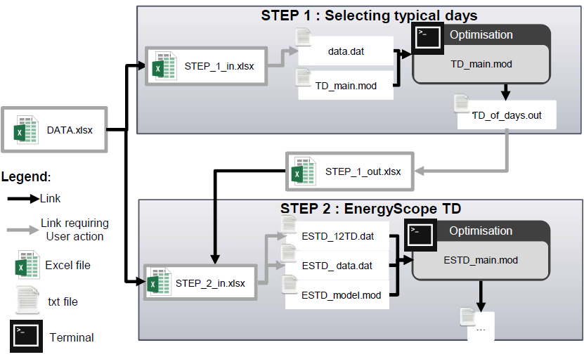

.. _workflow:

User manual
===========

The code, its documentation and the case study are gathered on a GitHub repository1. In the index and the README.md file is summarise how to launch the energy model in four steps. Here below, we propose an extensive explanation including how to compute the typical days and manage data. The data are managed through excel files which are related ones to each others. The models are coded in AMPL, using the solver CPLEX. However, the energy model proposed can be run using the open-source GLPK and the GLPSOL solver.

Files structure and download
----------------------------

EnergyScope Typical Days (EnergyScope TD) is structured as shown in Figure 13. A main folder contains three sub-folders, first one is dedicated to data management. Second, for the files related to typical days selection (STEP 1). Third and last branch regroups the files related to the energy model (STEP 2). Table 38 describes each files.
By ensuring that the download files respect the structure, the links between files should be respected and User could use the quick start procedure to launch the code.

.. list-table:: Table 35: Yearly shares of decentralized low temperature heat & CHP technologies for the Swiss energy system in 2011.
   :widths: 25 15
   :header-rows: 1

   * - Technologies
     - Share heat[%]
   * - HP
     - 6.0%
   * - Thermal HP
     - 0.0%
   * - CHP NG
     - 0.5%
   * - CHP Oil
     - 0.1%
   * - FC NG
     - 0.0%
   * - FC H2
     - 0.0%
   * - Boiler NG
     - 25.7%
   * - Boiler Wood
     - 8.2%
   * - Boiler Oil
     - 49.8%
   * - Solar Th.
     - 0.5%
   * - Direct Elec.
     - 9.2%
   

.. list-table:: Table 36: Yearly shares of DHN low temperature heat & CHP technologies for the Swiss energy system in 2011.
   :widths: 25 15
   :header-rows: 1

   * - Technologies
     - Share heat[%]
   * - HP
     - 4.8%
   * - CHP NG
     - 1.2%
   * - CHP Wood
     - 6.6%
   * - CHP Waste
     - 72.5%
   * - Boiler NG
     - 13.8%
   * - Boiler Wood
     - 0.0%
   * - Boiler Oil
     - 0.6%
   * - Deep Geothermal
     - 0.4%
   

.. list-table:: Table 37: Yearly shares of industrial high temperature heat & CHP technologies for the Swiss energy system in 2011
   :widths: 25 15
   :header-rows: 1

   * - Technologies
     - Share heat[%]
   * - CHP NG
     - 2.4%
   * - CHP Wood
     - 0.8%
   * - CHP Waste
     - 1.8%
   * - Boiler NG
     - 24.3%
   * - Boiler Wood
     - 7.0%
   * - Boiler Oil
     - 25.6%
   * - Boiler Coal
     - 5.1%
   * - Boiler Waste
     - 5.6%
   * - Direct Elec.
     - 27.5%
   

.. image:: images/structure.PNG
Figure 13: Files and folder structure

.. list-table:: Table 38: Description of the files in Figure 13.
   :widths: 25 25 45
   :header-rows: 1

   * - Folder
     - File name
     - Description
   * - EnergyScope TD
     -  '/'READ.md
      	Notice license
     -  Read me file
      	List of contributions and references
      	License file
   * - Data
     -  DATA.xlsx
      	STEP_1_in.xlsx
      	STEP_1_out.xlsx
      	STEP_2_in.xlsx
     -  All the input data
      	Prepare data for step 1
      	Process data from step 1
      	Prepare data for step 2
   * - STEP1
     -  data.dat
      	TD_main.mod
      	TD_of_days.out
     -  Data file for MILP problem
      	MILP problem
      	Output of MILP problem: sequence of days
   * - STEP2
     -  ESTD_12TD.dat
      	ESTD_data.dat
      	ESTD_model.mod
     -  Data file for LP problem related to time series and sequence of days for 12 TDs
      	Data file for LP problem related to technologies, scenarios...
      	LP problem
   * - Documentation
     -  Supplementary Material.pdf
     -  Full documentation of the code and data

Quick start
-----------

Figure 14 represents how data are managed between files listed in Figure 13 and how they are related to each others. in the following section, we will describe how to change the inputs data in DATA.xlsx, how to select typical days (STEP 1) and how to launch the energy system (STEP 2).
Each step is not mandatory, as User can skip a step and use the, already implemented, case which has all the input data to represent the Swiss energy system. Hence, Users who directly download the energy model and run it, will obtain the results presented in the paper.

Figure 14: Management of files. Black arrows represent automatic actions instead of grey arrows which require User action. Example, from the DATA.xlsx file, the input for the first step (STEP 1 in.xlsx) are automaticaly loaded (black arrow). The file computes the loaded information to generate the data required for the MILP problem. These data must be copy-paste on the data.dat file (grey arrow).

Data
^^^^
The DATA.xlsx file regroups all the required input data. An extensive description of these are given in Appendix 2. In the DATA.xlsx file, user can change each data, such as the cost of a technology, time series, the availability of resources or the maximum amount of wind turbines. The updated output files will be automatically generated, and user will just need to copy paste
them as described in Figure 14.

Step 1: selecting typical days
^^^^^^^^^^^^^^^^^^^^^^^^^^^^^^

**Input**
File STEP 1 in.xlsx loads the required data from the DATA.xlsx file, such as time series or number of typical days. The data required for STEP 1 MILP are generated in the .dat tab. User might copy-paste the tab in the data.dat file.

**Run**
Navigate to the subfolder .\STEP 1 TD selection folder via terminal/cmd prompt and execute (check glpsol documentation for more options):

	ˆ Linux: glpsol -m TD main.mod -d data.dat
	ˆ Mac OS X: glpsol -m TD main.mod -d data.dat
	ˆ Windows: glpsol.exe -m TD main.mod -d data.dat

**Output**
Results of the computation are recorded in TD of days.out. It contains the sequence of TDs over the year. This data must be copied-pasted in file STEP 1 out.xlsx.

Step 2: Energy model
^^^^^^^^^^^^^^^^^^^^

**Input**
File STEP 2 in.xlsx loads the required data from the DATA.xlsx and STEP 1 out.xlsx files. Then, required data are generated and must be copied-pasted. From the excel tabs ESTD data.dat and ESTD 12TD.dat to files ESTD data.dat and ESTD 12TD.dat, respectively. Here, we choose 12 typical days, but the STEP 1 out.xlsx file generates also files for 4, 8, 24, 48 and 365 typical days. File ESTD data.dat encompass all the information not related to typical days, such as technologies characterisations, resources prices and availability etc... File ESTD 12TDs.dat encompass the time series related to 12 typical days and the relation between TDs and days

**Run**
Navigate to the subfolder .nSTEP 2 Energy Model via terminal/cmd prompt and execute (check glpsol documentation for more options):

	ˆ Linux : glpsol -m ESTD model.mod -d ESTD data.dat -d ESTD 12TD.dat -o ses main.out
	ˆ Mac OS X : glpsol -m ESTD model.mod -d ESTD data.dat -d ESTD 12TD.dat -o ses main.out
	ˆ Windows : glpsol.exe ESTD model.mod -d ESTD data.dat -d ESTD 12TD.dat -o ses main.out

**Output**
Output files are generated automatically in folder ./output.
.. _README.md: